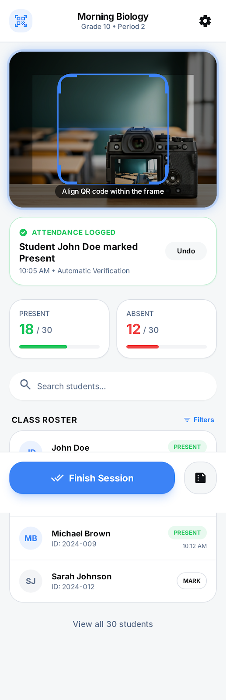
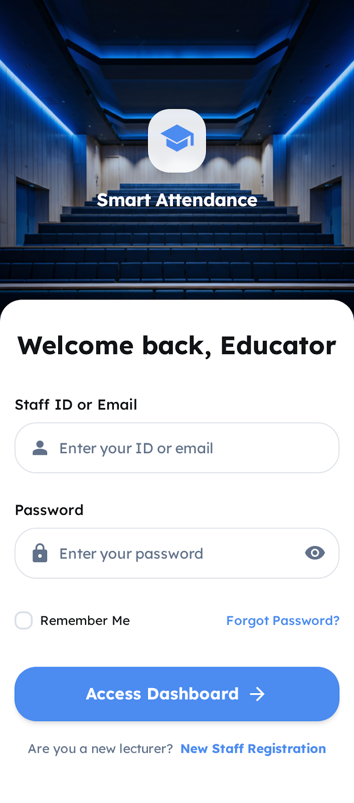
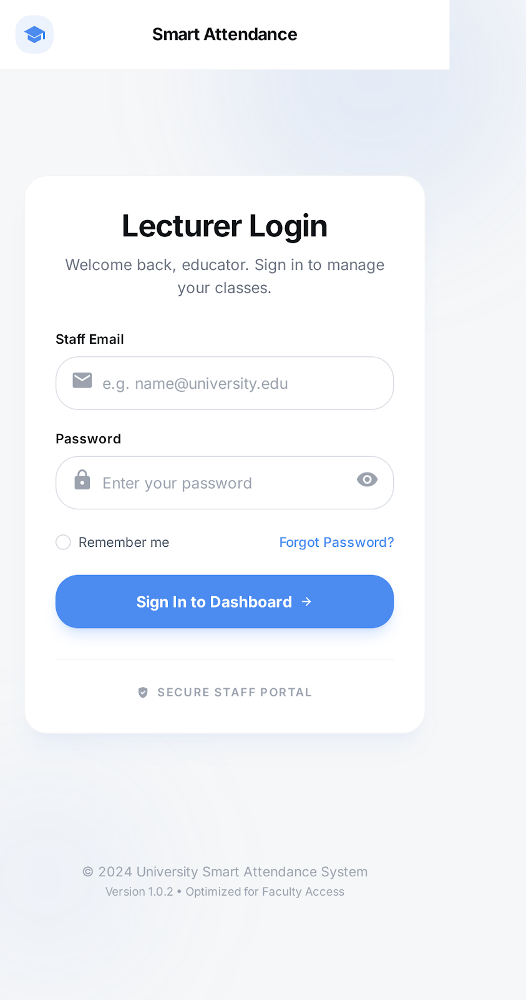
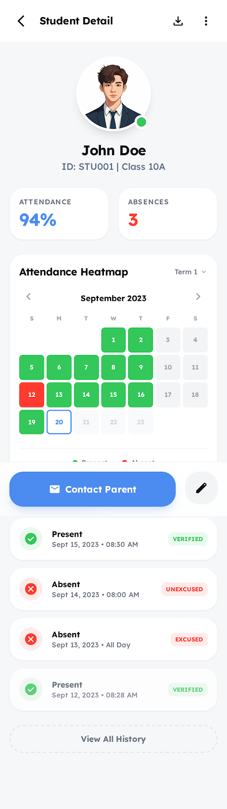
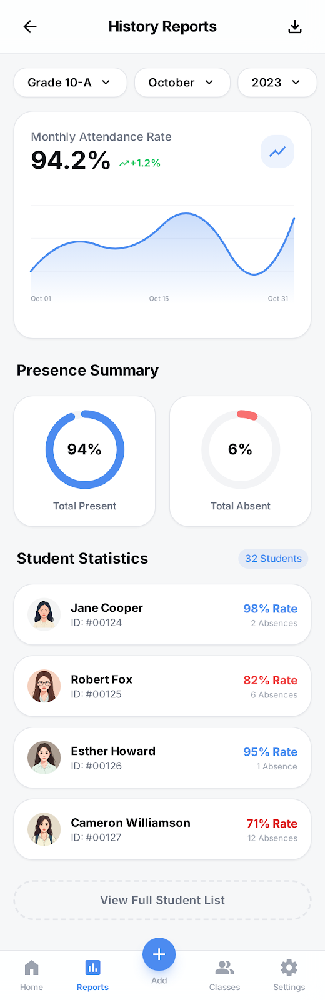
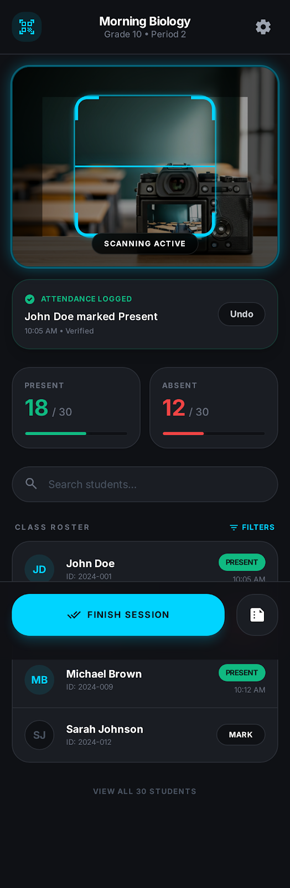
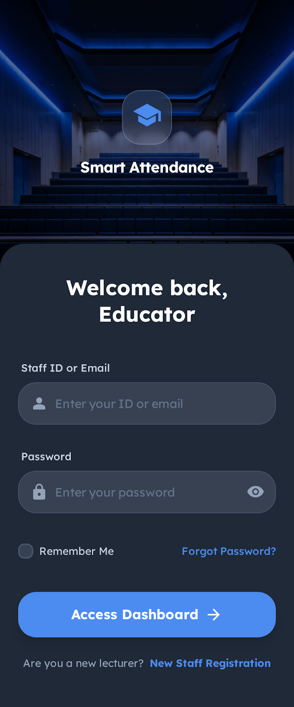
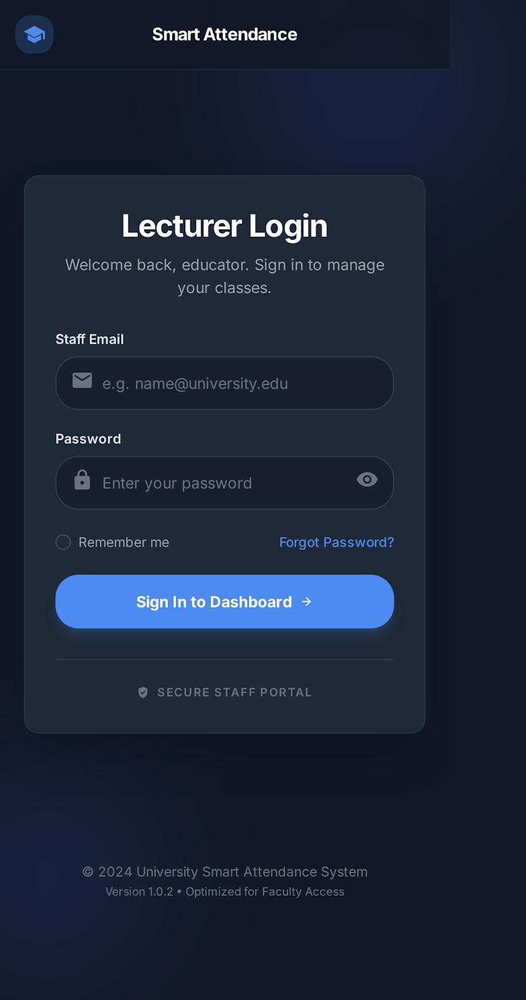
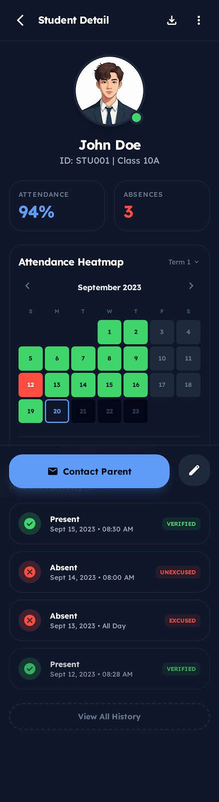
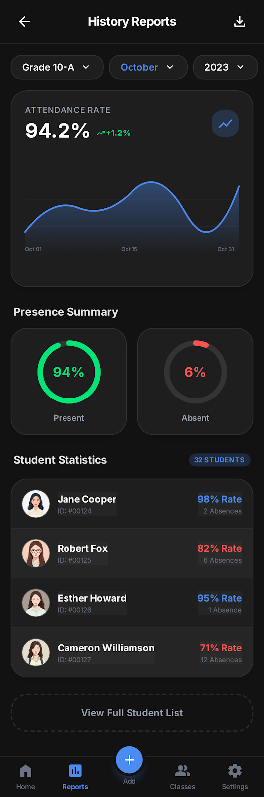

# Barcode Attendance System (BAS)

A modern, reliable, and easy-to-use barcode attendance system designed for universities. This project is the frontend implementation, built with Vue.js and designed to provide a clean, professional, and user-friendly interface for both students and lecturers.

## 🎨 Design & Interface

The UI is designed to be modern, clean, and academic-friendly. It features a dual-theme system, allowing users to switch between a light and a dark mode for optimal viewing comfort. The interface is fully responsive and built with a focus on clear visual hierarchy and high readability.

### Light Mode
| Home | Student Login | Lecturer Login |
| --- | --- | --- |
|  |  |  |

| Student Homepage | Report Page |
| --- | --- |
|  |  |

### Dark Mode
| Home | Student Login | Lecturer Login |
| --- | --- | --- |
|  |  |  |

| Student Homepage | Report Page |
| --- | --- |
|  |  |


## ✨ Features

*   **Dual-Theme UI:** Seamlessly switch between Light and Dark modes.
*   **Distinct User Portals:** Separate login and dashboard experiences for Students and Lecturers.
*   **Lecturer Dashboard:** A comprehensive view for lecturers to manage their courses, view student information, and track attendance in real-time.
    *   **Course and Session Management:** Create, update, and manage courses and attendance sessions.
    *   **Barcode Scanning:** Utilize the device's camera to scan student ID barcodes for quick and efficient attendance marking.
    *   **Real-time Roster:** View a live roster of students for each session, with instant updates as attendance is taken.
    *   **Manual Attendance:** Manually mark students as present or absent.
    *   **Reporting:** Generate and export attendance reports in Excel format.
*   **Student Dashboard:** A personalized dashboard for students to monitor their attendance and academic standing.
    *   **Attendance Tracking:** View overall attendance statistics and a detailed history of attended and missed sessions.
    *   **Attendance Heatmap:** Visualize attendance patterns throughout the semester with an intuitive heatmap.
    *   **Recent Activity:** See a timeline of recent attendance activity.
*   **Authentication:** Secure authentication for both lecturers and students using Supabase Auth.
*   **Modern Tech Stack:** Built with Vue.js 3, Vite, and modern CSS for a fast and reliable experience.

## 🛠 Tech Stack

*   **Framework:** [Vue.js 3](https://vuejs.org/)
*   **Build Tool:** [Vite](https://vitejs.dev/)
*   **Backend:** [Supabase](https://supabase.io/)
*   **Routing:** [Vue Router](https://router.vuejs.org/)
*   **State Management:** [Pinia](https://pinia.vuejs.org/)
*   **Styling:** [Tailwind CSS](https://tailwindcss.com/) & CSS with Variables for Theming
*   **Linting:** [ESLint](https://eslint.org/)
*   **Barcode Scanning:** [QuaggaJS](https://serratus.github.io/quaggaJS/)
*   **Excel Export:** [ExcelJS](https://github.com/exceljs/exceljs)

## 🚀 Getting Started

To get the frontend running locally, follow these steps:

1.  **Clone the repository:**
    ```bash
    git clone https://github.com/your-username/BAS-Web.git
    cd BAS-Web
    ```

2.  **Navigate to the project directory:**
    The Vue.js project is located in the `BAS` sub-directory.
    ```bash
    cd BAS
    ```

3.  **Install dependencies:**
    ```bash
    npm install
    ```

4.  **Set up environment variables:**
    Create a `.env` file in the `BAS` directory by copying the `.env.example` file. Then, fill in the required Supabase URL and anonymous key.
    ```bash
    cp .env.example .env
    ```

5.  **Run the development server:**
    ```bash
    npm run dev
    ```

The application will be available at the local address provided by Vite (e.g., `http://localhost:5173`).

## 📄 Project Structure

*   `BAS/`: Contains the Vue.js application source code.
    *   `src/`: The main source folder.
        *   `assets/`: Global styles and static assets.
        *   `components/`: Reusable Vue components (UI elements, layout, and page sections).
            *   `layout/`: Components that define the overall structure of the application (e.g., Navbar).
            *   `ui/`: Generic, reusable UI components (e.g., Button, Modal).
        *   `composables/`: Vue composables for reusable logic (e.g., `useAuth.js`, `useTheme.js`).
        *   `router/`: Vue Router configuration, including route definitions and navigation guards.
        *   `stores/`: Pinia stores for state management (e.g., `userStore.js`).
        *   `supabase.js`: Configuration for the Supabase client.
        *   `views/`: Page-level components that correspond to specific routes.
*   `docs/`: Contains UI design images and project documentation.

