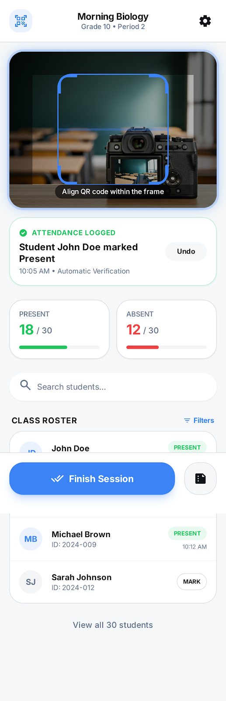
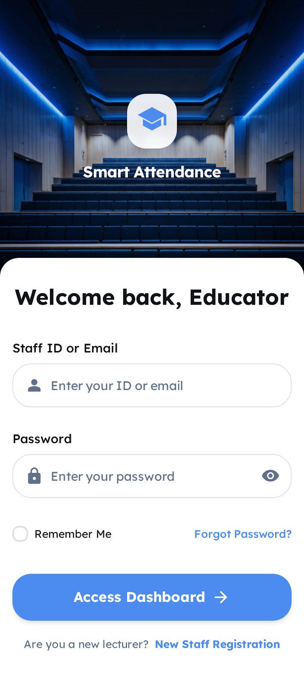
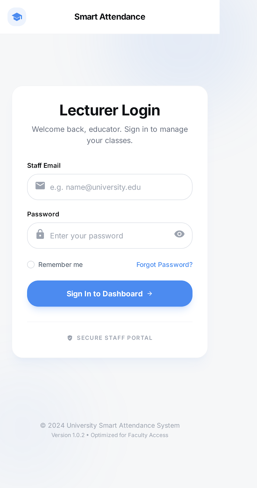
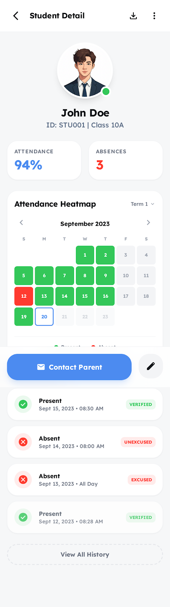
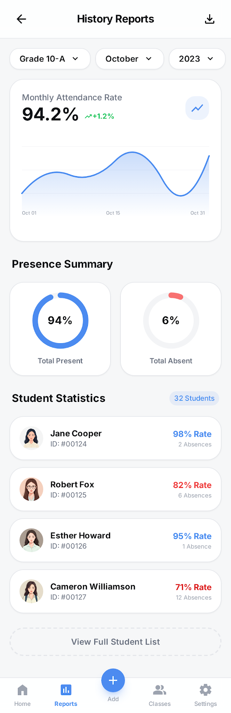
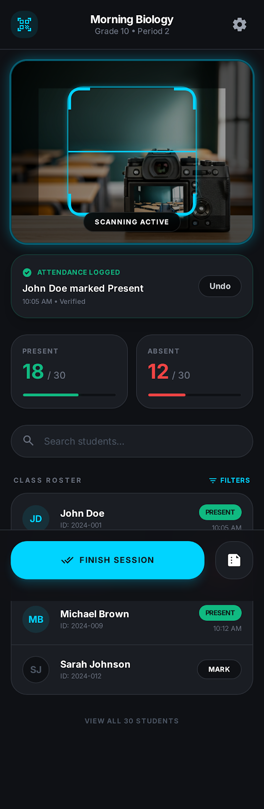
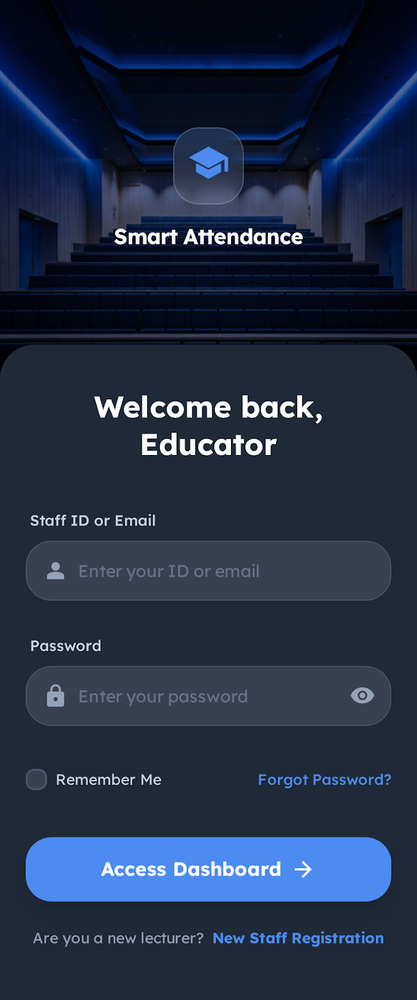
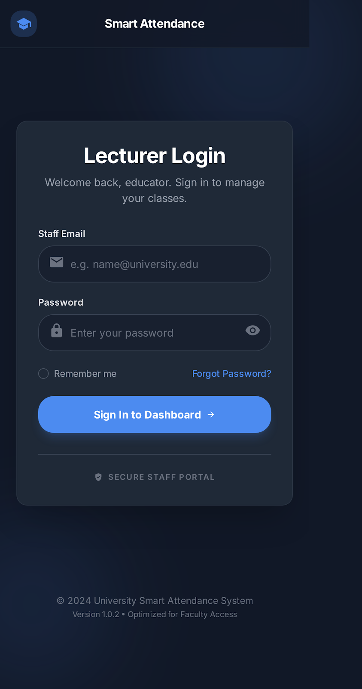
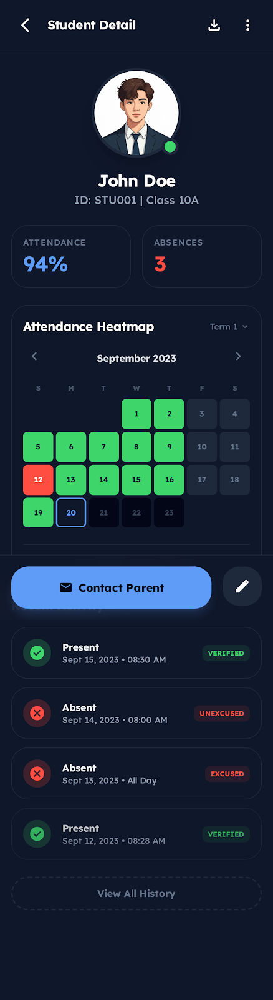
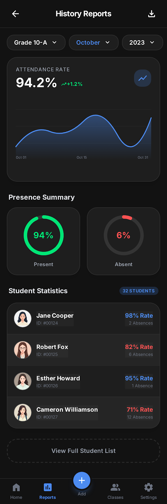

<!-- markdownlint-disable MD033 -->
# Barcode Attendance System (BAS)


A modern, reliable, and easy-to-use barcode-based attendance system designed for universities. This project is the frontend implementation, built with Vue.js and designed to provide a clean, professional, and user-friendly interface for both students and lecturers.

## 🎨 Design & Interface

The UI is designed to be modern, clean, and academic-friendly. It features a dual-theme system, allowing users to switch between a light and a dark mode for optimal viewing comfort. The interface is fully responsive and built with a focus on clear visual hierarchy and high readability.

### Light Mode

| Home                                                                 | Student Login                                                                          | Lecturer Login                                                                           |
| -------------------------------------------------------------------- | -------------------------------------------------------------------------------------- | ---------------------------------------------------------------------------------------- |
|  |  |  |

| Student Homepage                                                                        | Report Page                                                                   |
| --------------------------------------------------------------------------------------- | ----------------------------------------------------------------------------- |
|  |  |

### Dark Mode

| Home                                                                | Student Login                                                                         | Lecturer Login                                                                          |
| ------------------------------------------------------------------- | ------------------------------------------------------------------------------------- | --------------------------------------------------------------------------------------- |
|  |  |  |

| Student Homepage                                                                       | Report Page                                                                  |
| -------------------------------------------------------------------------------------- | ---------------------------------------------------------------------------- |
|  |  |


## ✨ Features

* **Dual-Theme UI:** Seamlessly switch between Light and Dark modes.
* **Distinct User Portals:** Separate login and dashboard experiences for Students and Lecturers.
* **Lecturer Dashboard:** A comprehensive view for lecturers to manage their courses, view student information, and track attendance in real-time.
    * **Course and Session Management:** Create, update, and manage courses and attendance sessions.
    * **Barcode Scanning:** Utilize the device's camera to scan student ID barcodes for quick and efficient attendance marking.
    * **Real-time Roster:** View a live roster of students for each session, with instant updates as attendance is taken.
    * **Manual Attendance:** Manually mark students as present or absent.
    * **Reporting:** Generate and export attendance reports in Excel format.
* **Student Dashboard:** A personalized dashboard for students to monitor their attendance and academic standing.
    * **Attendance Tracking:** View overall attendance statistics and a detailed history of attended and missed sessions.
    * **Attendance Heatmap:** Visualize attendance patterns throughout the semester with an intuitive heatmap.
    * **Recent Activity:** See a timeline of recent attendance activity.
* **Authentication:** Secure authentication for both lecturers and students using Supabase Auth.
* **Modern Tech Stack:** Built with Vue.js 3, Vite, and modern CSS for a fast and reliable experience.

## 🛠 Tech Stack

*   **Framework:** [Vue.js 3](https://vuejs.org/)
*   **Build Tool:** [Vite](https://vitejs.dev/)
*   **Backend:** [Supabase](https://supabase.io/)
*   **Routing:** [Vue Router](https://router.vuejs.org/)
*   **State Management:** [Pinia](https://pinia.vuejs.org/)
*   **Styling:** [Tailwind CSS](https://tailwindcss.com/) & CSS with Variables for Theming
*   **Form Validation:** [VeeValidate](https://vee-validate.logaretm.com/) & [Yup](https://github.com/jquense/yup)
*   **Charts:** [Chart.js](https://www.chartjs.org/) via [vue-chartjs](https://vue-chartjs.org/)
*   **Barcode Scanning:** [QuaggaJS 2](https://github.com/ericblade/quagga2)
*   **Barcode Generation:** [JsBarcode](https://github.com/lindell/JsBarcode)
*   **Excel Export:** [ExcelJS](https://github.com/exceljs/exceljs)
*   **Linting:** [ESLint](https://eslint.org/)
*   **Unit Testing:** [Vitest](https://vitest.dev/) & [Vue Test Utils](https://test-utils.vuejs.org/)
*   **E2E Testing:** [Playwright](https://playwright.dev/)

## 🚀 Getting Started

To get the frontend running locally, follow these steps:

1. **Clone the repository:**
    ```bash
    git clone https://github.com/Zakir176/BAS-Web.git
    cd BAS-Web
    ```

2. **Navigate to the project directory:**
    The Vue.js project is located in the `BAS` sub-directory.
    ```bash
    cd BAS
    ```

3. **Install dependencies:**
    ```bash
    npm install
    ```

    > **Node version:** Requires Node `^20.19.0` or `>=22.12.0`.

4. **Set up environment variables:**
    Create a `.env` file in the `BAS` directory by copying the example file. Then, fill in the required Supabase URL and anonymous key.

    ```bash
    # macOS / Linux
    cp .env.example .env

    # Windows (Command Prompt)
    copy .env.example .env

    # Windows (PowerShell)
    Copy-Item .env.example .env
    ```

    Open `.env` and set:
    ```env
    VITE_SUPABASE_URL=your_supabase_project_url
    VITE_SUPABASE_ANON_KEY=your_supabase_anon_key
    ```

5. **Run the development server:**
    ```bash
    npm run dev
    ```

The application will be available at the local address provided by Vite (e.g., `http://localhost:5173`).

## 🧪 Testing

This project uses **Vitest** for unit/component tests and **Playwright** for end-to-end (E2E) integration tests.

### Unit Tests (Vitest)

```bash
# Run tests in watch mode
npm run test

# Run tests once (CI mode)
npm run test:run

# Run with interactive UI
npm run test:ui

# Run with coverage report
npm run test:coverage
```

Unit test files are co-located in `BAS/src/test/`.

### E2E Tests (Playwright)

```bash
# Install Playwright browsers (first time only)
npx playwright install

# Run all E2E tests
npx playwright test

# Run a specific test file
npx playwright test tests/auth-redirect-integration.spec.ts
```

E2E test files are located in `BAS/tests/`. Key test suites include:

*   `auth-redirect-integration.spec.ts` — Auth flow and route guard integration
*   `improved-student-auth.spec.ts` / `improved-lecturer-auth.spec.ts` — Login/logout flows
*   `barcode-scanning.spec.ts` — Scanner functionality

> **Note:** E2E tests require a running dev server and valid Supabase credentials in `.env`. See `tests/global-setup.ts` for setup details.

## 📄 Project Structure

```
BAS-Web/
├── BAS/                        # Vue.js application root
│   ├── src/
│   │   ├── assets/             # Global styles and static assets
│   │   ├── components/         # Reusable Vue components
│   │   ├── core/               # Core abstractions
│   │   │   ├── api/            # Supabase API wrappers
│   │   │   └── ui/             # Core UI primitives
│   │   ├── features/           # Feature-based modules
│   │   │   ├── auth/           # Authentication views & logic
│   │   │   ├── home/           # Landing/home page
│   │   │   ├── lecturer/       # Lecturer dashboard & components
│   │   │   ├── scanner/        # Barcode scanner feature
│   │   │   ├── student/        # Student dashboard & components
│   │   │   └── legal/          # Terms, privacy, etc.
│   │   ├── router/             # Vue Router config & navigation guards
│   │   ├── services/           # Business logic / service layer
│   │   ├── shared/             # Shared utilities and composables
│   │   ├── stores/             # Pinia state stores
│   │   ├── views/              # Page-level route components
│   │   └── main.js             # App entry point
│   └── tests/                  # Playwright E2E test suite
│       ├── utils/              # Shared test helpers
│       ├── global-setup.ts     # Test environment setup
│       └── global-teardown.ts  # Test environment teardown
└── docs/                       # Project documentation & UI screenshots
    ├── ui/                     # UI screenshots (light & dark mode)
    ├── api.md                  # API reference
    ├── components.md           # Component documentation
    ├── DEPLOYMENT.md           # Deployment guide
    └── TROUBLESHOOTING.md      # Common issues & FAQ
```

## 📚 Documentation

| Document | Description |
| -------- | ----------- |
| [API Reference](docs/api.md) | Supabase API wrappers and data layer |
| [Component Docs](docs/components.md) | Reusable component reference |
| [Deployment Guide](docs/DEPLOYMENT.md) | How to deploy to production |
| [Troubleshooting Guide](docs/TROUBLESHOOTING.md) | Common fixes for scanner and connection issues |

## 📄 License

This project is licensed under the [MIT License](LICENSE).
