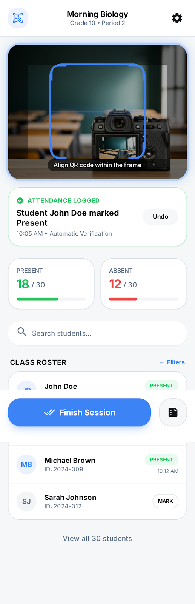
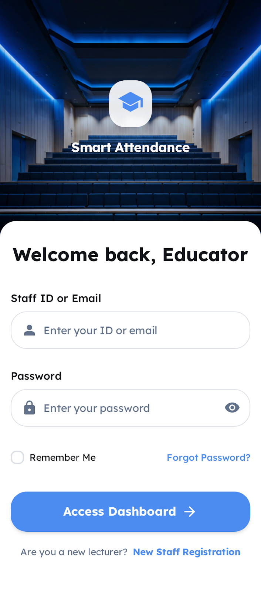
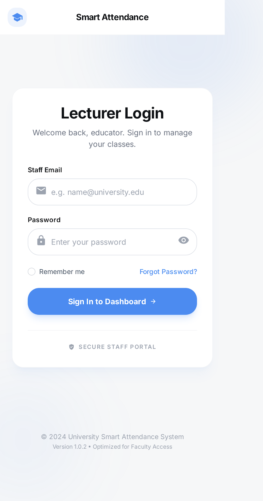
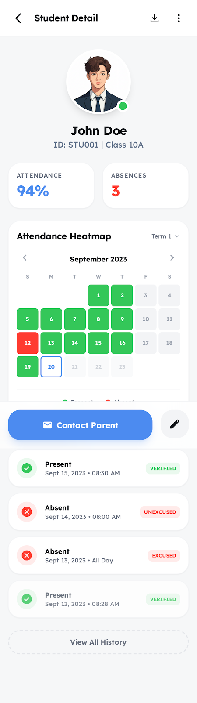
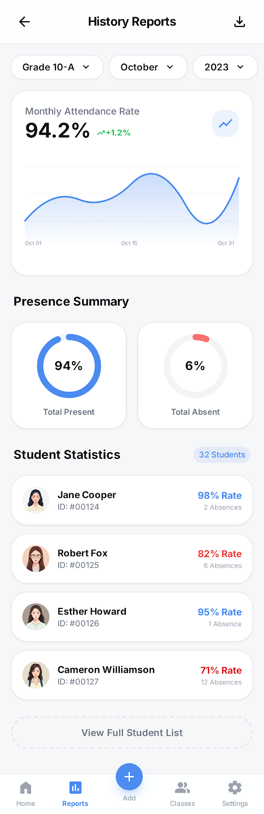
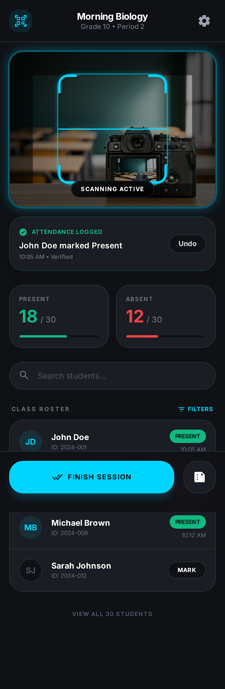
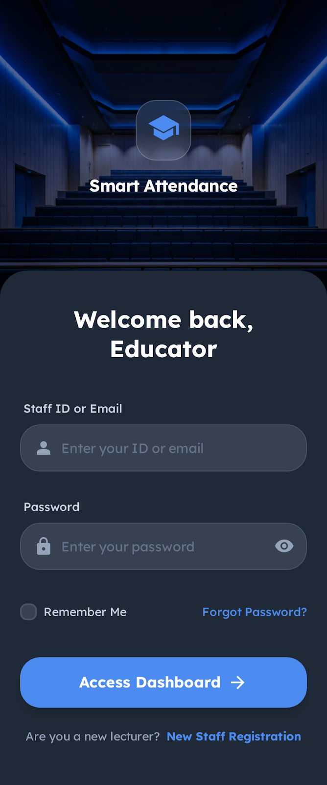
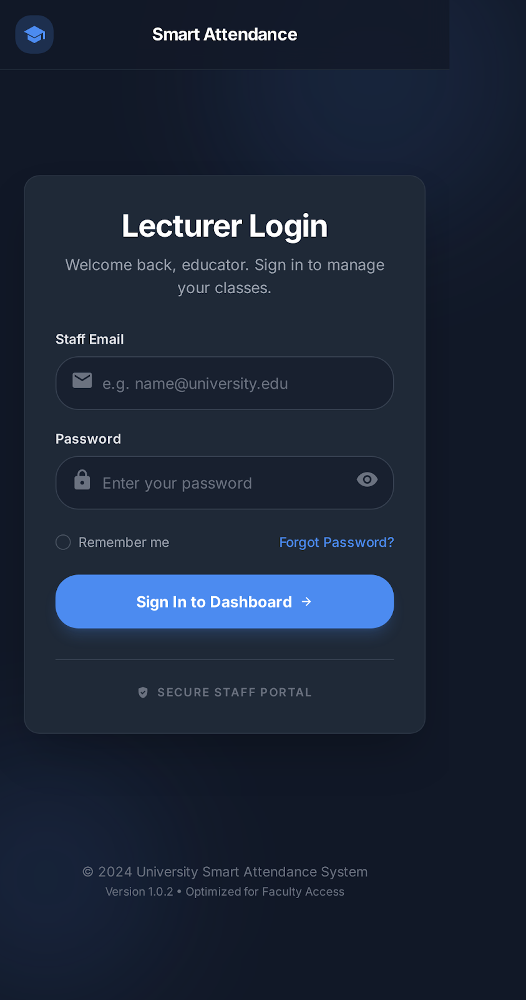
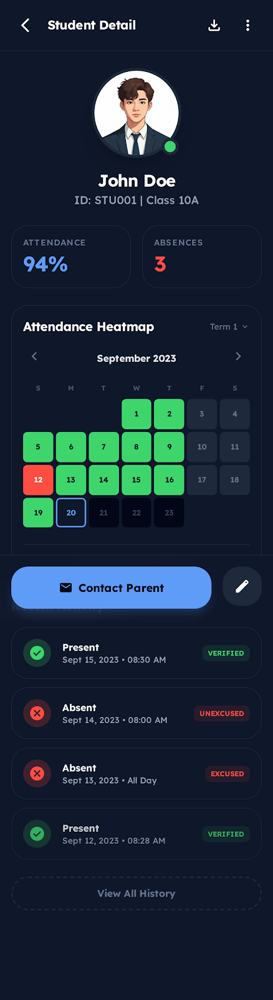
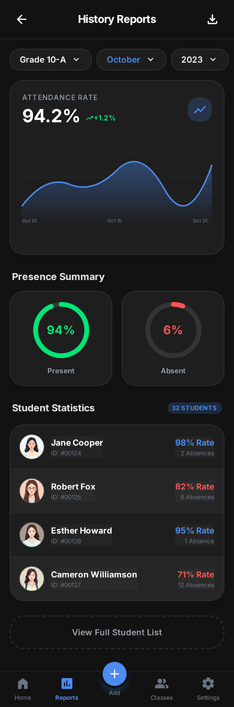

<!-- markdownlint-disable MD033 -->
# Barcode Attendance System (BAS)


> 🎓 **Digital Campus Infrastructure** — A high-density, professional barcode-based attendance system designed for universities. Built with Vue.js 3, Supabase, and modern web technologies to provide a seamless experience for students and lecturers.

A modern, reliable, and easy-to-use attendance management platform that transforms how academic institutions track class participation. This frontend implementation delivers a clean, professional, and user-friendly interface with real-time scanning, intelligent roster management, and comprehensive attendance analytics.

## 🎨 Design & Interface

The UI is designed to be modern, clean, and academic-friendly. It features a dual-theme system, allowing users to switch between a light and a dark mode for optimal viewing comfort. The interface is fully responsive and built with a focus on clear visual hierarchy and high readability.

### Light Mode

| Home                                                                 | Student Login                                                                          | Lecturer Login                                                                           |
| -------------------------------------------------------------------- | -------------------------------------------------------------------------------------- | ---------------------------------------------------------------------------------------- |
|  |  |  |

| Student Homepage                                                                        | Report Page                                                                   |
| --------------------------------------------------------------------------------------- | ----------------------------------------------------------------------------- |
|  |  |

### Dark Mode

| Home                                                                | Student Login                                                                         | Lecturer Login                                                                          |
| ------------------------------------------------------------------- | ------------------------------------------------------------------------------------- | --------------------------------------------------------------------------------------- |
|  |  |  |

| Student Homepage                                                                       | Report Page                                                                  |
| -------------------------------------------------------------------------------------- | ---------------------------------------------------------------------------- |
|  |  |


## ✨ Key Features

### 👨‍🎓 For Students
- **Attendance Dashboard:** Personal attendance overview with real-time statistics
- **Session Tracking:** View attended and missed sessions with timestamps
- **Attendance Heatmap:** Visualize your attendance patterns throughout the semester
- **Activity Timeline:** Monitor recent attendance events at a glance

### 👨‍🏫 For Lecturers
- **Course Management:** Create and manage courses with multiple sessions
- **Real-Time Barcode Scanning:** Use your device camera to scan student barcodes instantly
- **Live Roster:** Interactive, searchable roster with immediate attendance updates
- **Manual Attendance:** Mark students present/absent when scanning isn't available
- **Attendance Reports:** Generate and export attendance data in Excel format
- **Analytics Dashboard:** Visual KPIs for attendance trends and course health

### 🎨 UI/UX Excellence
- **Dual-Theme System:** Seamless toggle between Light and Dark modes
- **Glassmorphism Design:** Premium UI aesthetics with frosted-surface effects
- **Fully Responsive:** Optimized for desktop, tablet, and mobile devices
- **Accessibility First:** Built with semantic HTML and WCAG standards
- **Professional Aesthetics:** Clean, modern interface designed for academic environments

## 🎯 Quick Links

| Resource | Description |
| :------- | :---------- |
| [🚀 Getting Started](#-getting-started) | Set up the project locally in minutes |
| [🧪 Testing Guide](#-testing) | Learn about unit tests and E2E testing |
| [📚 Documentation](docs/) | API reference, components, deployment, and troubleshooting |
| [🎨 Design System](BAS/DESIGN_SYSTEM.md) | UI components and design language |
| [📝 Contributing](CONTRIBUTING.md) | Guidelines for contributing to the project |

## 🛠 Tech Stack

| Category | Technology |
| :------- | :---------- |
| **Framework** | [Vue.js 3](https://vuejs.org/) (Composition API) + [Vite](https://vitejs.dev/) |
| **Styling** | [Tailwind CSS](https://tailwindcss.com/) + Custom HSL tokens for theming |
| **State Management** | [Pinia](https://pinia.vuejs.org/) |
| **Routing** | [Vue Router](https://router.vuejs.org/) with protected routes |
| **Backend & Auth** | [Supabase](https://supabase.io/) (PostgreSQL + Realtime) |
| **Form Validation** | [VeeValidate](https://vee-validate.logaretm.com/) + [Yup](https://github.com/jquense/yup) |
| **Scanning** | [QuaggaJS 2](https://github.com/ericblade/quagga2) + [JsBarcode](https://github.com/lindell/JsBarcode) |
| **Data Export** | [ExcelJS](https://github.com/exceljs/exceljs) |
| **Charts & Visualization** | [Chart.js](https://www.chartjs.org/) via [vue-chartjs](https://vue-chartjs.org/) |
| **Testing** | [Vitest](https://vitest.dev/) + [Vue Test Utils](https://test-utils.vuejs.org/) (Unit) |
| **E2E Testing** | [Playwright](https://playwright.dev/) |
| **Code Quality** | [ESLint](https://eslint.org/) + [Prettier](https://prettier.io/) |

## 🚀 Getting Started

### Prerequisites
- **Node.js** `^20.19.0` or `>=22.12.0`
- **npm** or **yarn** package manager
- A [Supabase](https://supabase.io/) project with authentication enabled

### Installation

1. **Clone and navigate to the repository:**
    ```bash
    git clone https://github.com/Zakir176/BAS-Web.git
    cd BAS-Web/BAS
    ```

2. **Install dependencies:**
    ```bash
    npm install
    ```

3. **Configure environment variables:**
    ```bash
    # macOS / Linux
    cp .env.example .env

    # Windows (Command Prompt)
    copy .env.example .env

    # Windows (PowerShell)
    Copy-Item .env.example .env
    ```

    Then edit `.env` with your Supabase credentials:
    ```env
    VITE_SUPABASE_URL=https://your-project.supabase.co
    VITE_SUPABASE_ANON_KEY=your-anon-key
    ```

4. **Start the development server:**
    ```bash
    npm run dev
    ```

The application will be available at `http://localhost:5173` (or the URL shown by Vite).

### Build for Production
```bash
npm run build
npm run preview  # Preview the production build locally
```

## 🧪 Testing

This project maintains high quality through comprehensive unit and end-to-end testing.

### Unit Tests (Vitest)

Test individual components and business logic.

```bash
# Run in watch mode (recommended for development)
npm run test

# Run once (CI mode)
npm run test:run

# Interactive UI dashboard
npm run test:ui

# Generate coverage report
npm run test:coverage
```

Test files are located in `BAS/src/test/` alongside their corresponding components.

### E2E Tests (Playwright)

Test complete user workflows across the entire application.

```bash
# Install Playwright browsers (first time only)
npx playwright install

# Run all tests
npx playwright test

# Run tests in headed mode (watch browser)
npx playwright test --headed

# Run a specific test file
npx playwright test tests/barcode-scanning.spec.ts

# Run tests with debugging
npx playwright test --debug
```

**Key Test Suites:**
- `auth-redirect-integration.spec.ts` — Authentication flows and route protection
- `improved-student-auth.spec.ts` — Student login/logout workflows
- `improved-lecturer-auth.spec.ts` — Lecturer authentication
- `barcode-scanning.spec.ts` — Scanner functionality and barcode detection
- `student-signup-and-login.spec.ts` — Complete signup and login flow

> **Requirements:** E2E tests need a running dev server and valid Supabase credentials. See [tests/global-setup.ts](BAS/tests/global-setup.ts) for configuration details.

## � Project Structure

```
BAS-Web/
├── BAS/                          # Vue.js Frontend Application
│   ├── src/
│   │   ├── App.vue              # Root Vue component
│   │   ├── main.js              # Application entry point
│   │   ├── assets/              # Global styles and static assets
│   │   ├── components/          # Reusable UI components
│   │   ├── core/                # Core application abstractions
│   │   │   ├── api/             # Supabase API client wrappers
│   │   │   └── ui/              # Core UI component library
│   │   ├── features/            # Feature-based module directory
│   │   │   ├── auth/            # Authentication views & composables
│   │   │   ├── home/            # Landing page
│   │   │   ├── lecturer/        # Lecturer dashboard & components
│   │   │   ├── scanner/         # Barcode scanning feature
│   │   │   ├── student/         # Student dashboard & views
│   │   │   └── legal/           # Legal pages (terms, privacy)
│   │   ├── router/              # Vue Router configuration & guards
│   │   ├── services/            # Business logic layer
│   │   ├── shared/              # Shared utilities and composables
│   │   ├── stores/              # Pinia state management
│   │   ├── views/               # Route-level page components
│   │   └── test/                # Unit tests (co-located with src)
│   ├── tests/                   # Playwright E2E test suite
│   │   ├── *.spec.ts            # Test scenarios
│   │   ├── utils/               # Test helpers and utilities
│   │   ├── global-setup.ts      # Pre-test environment setup
│   │   └── global-teardown.ts   # Post-test cleanup
│   ├── migrations/              # Database migration scripts
│   ├── public/                  # Static assets
│   ├── index.html               # HTML entry point
│   ├── vite.config.js           # Vite build configuration
│   ├── playwright.config.ts     # Playwright test configuration
│   ├── tailwind.config.js       # Tailwind CSS configuration
│   ├── eslint.config.js         # ESLint rules
│   ├── postcss.config.js        # PostCSS plugins
│   ├── package.json             # Frontend dependencies
│   ├── .env.example             # Environment variables template
│   └── DESIGN_SYSTEM.md         # Component and design system docs
│
├── catv1/                       # .NET/C# Native Mobile App
│   ├── catv1.csproj            # Project file
│   ├── MauiProgram.cs          # MAUI app initialization
│   ├── Services/               # Business logic services
│   ├── Models/                 # Data models
│   ├── ViewModels/            # MVVM view models
│   ├── Views/                  # UI pages
│   ├── Converters/            # Value converters
│   ├── Resources/              # App resources (styles, images)
│   └── Platforms/              # Platform-specific code
│
├── docs/                        # Project Documentation
│   ├── api.md                  # API reference guide
│   ├── components.md           # Component documentation
│   ├── DEPLOYMENT.md           # Deployment instructions
│   ├── TROUBLESHOOTING.md      # Common issues & solutions
│   ├── ui/                     # UI screenshots
│   │   ├── light_mode/         # Light theme screenshots
│   │   └── dark_mode/          # Dark theme screenshots
│   └── sample/                 # Sample data and examples
│
├── README.md                    # Main project documentation (you are here)
├── CONTRIBUTING.md             # Contribution guidelines
├── catv1.sln                   # Visual Studio solution file
└── LICENSE                     # MIT License
```

### Key Directories Explained

- **`features/`** — Feature-based module structure for better organization and scalability
- **`stores/`** — Centralized state management using Pinia
- **`services/`** — API calls and business logic separated from components
- **`shared/`** — Composables and utilities reused across features
- **`tests/`** — E2E tests with global setup/teardown for consistent test environments

## 📚 Documentation

| Document | Description |
| -------- | ----------- |
| [API Reference](docs/api.md) | Supabase API wrappers and data layer |
| [Component Docs](docs/components.md) | Reusable component reference |
| [Deployment Guide](docs/DEPLOYMENT.md) | How to deploy to production |
| [Troubleshooting Guide](docs/TROUBLESHOOTING.md) | Common fixes for scanner and connection issues |

## 📄 License

This project is licensed under the [MIT License](LICENSE).
